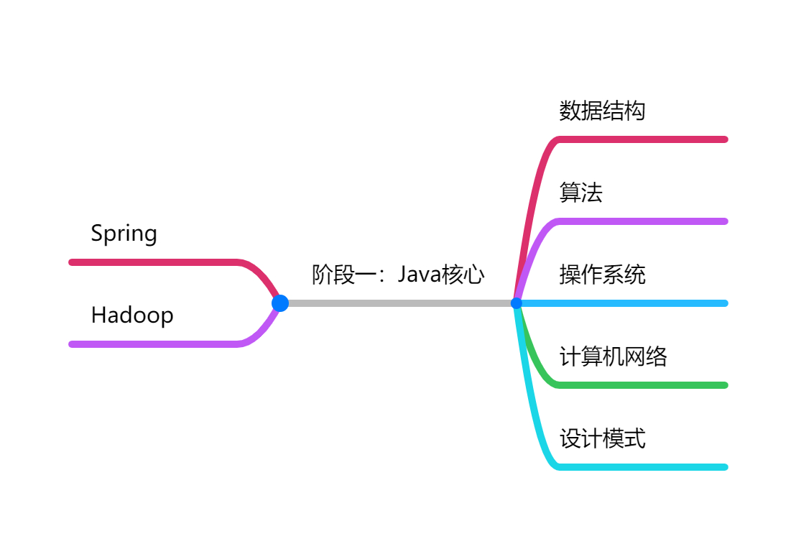

# 人生

- life

# 内功-基础

- algorithm
- os
  - linux
  - windows
- design
- ds
- se-software engineering
- network
  - ccna

# 招式-技术

- front
- java
- bigdate
  - hadoop
  - spark
  - hdfs
  - hive
  - kudu
  - yarn
  - zookeeper
  - hbase
- graph
  - janusgraph
  - neo4j
  - orientdb
- db
  - mysql
  - postgres
  - oracle
  - es
- python
- front
  - angular
- opm-Operation and Maintenance
  - docker
  - k8s
  - jenkins
  - bamboo
- tool
  - digtal
  - hexo
  - markdown

# 机器学习
- NER

# 面试

- interview

# 阶段一

阶段一：Java核心

- 阶段一：Java核心（右）
  - 数据结构
  - 算法
  - 操作系统
  - 计算机网络
  - 设计模式
- 阶段一：Java核心（左）
  - Spring
  - Hadoop

